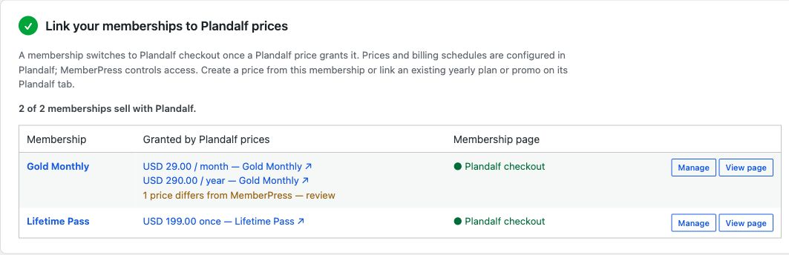

# Plandalf for MemberPress: WordPress checkout plugin

Sell MemberPress memberships through Plandalf checkout. The plugin connects to
Plandalf's public API and receives signed purchase events to grant membership access.

[Download v0.1.0](https://github.com/plandalf/memberpress/releases/tag/v0.1.0) · [Setup guide](https://plandalf.com/docs/product-guides/platforms/memberpress) · [MemberPress integration](https://plandalf.com/platforms/memberpress)

**Early access:** the plugin source and ZIP are available. The default hosted Plandalf connection endpoint is not yet deployed, so a standard hosted setup cannot currently connect. Use a compatible development server for evaluation; wait for hosted availability before replacing a live checkout.



*Captured from the running plugin on a local WordPress test site, 4 October 2026.*

## What the plugin does

- Replaces linked MemberPress signup forms with your Plandalf checkout design.
- Maps multiple billing prices, such as monthly and yearly, to one membership.
- Applies signed purchase events and records the corresponding MemberPress transactions.
- Handles subscription renewal, cancellation and refund events, with duplicate-delivery protection.
- Provides new buyers with a password-setup handoff after membership fulfilment.

MemberPress continues to manage protected content, membership rules and member accounts. Payments use the processor connected to Plandalf.


## Requirements

- WordPress 6.4 or later and PHP 8.2 or later.
- An active MemberPress installation (local checks used MemberPress 1.12.6).
- A Plandalf account with a connected Stripe account.
- An HTTPS WordPress site reachable by Plandalf for purchase-event delivery.

## Installation

Download the **plandalf-memberpress ZIP release asset** and upload it through
**WordPress → Plugins → Add New → Upload Plugin**. GitHub's automatic source archives
include development files; use the packaged asset for installation.

Activate the plugin, open **MemberPress → Plandalf**, connect your account, choose a
checkout design, and create or link the prices that grant each membership.

[Integration guide](https://plandalf.com/docs/product-guides/platforms/memberpress)

## Development

This repository is the standalone plugin source. From its root:

```sh
npm test
npm run build
```

No npm dependencies are needed. The build requires Node.js 22 or later and `zip`.
It writes `dist/plandalf-memberpress.zip` and a versioned copy. Only runtime files
are packaged; tests, development instructions and build tooling are excluded.

To use the checkout in a development WordPress installation:

```sh
ln -s "$PWD" /path/to/wordpress/wp-content/plugins/plandalf-memberpress
```

The PHP integration suite requires WordPress and MemberPress. Run it from that
WordPress installation with this repository installed as the active plugin:

```sh
wp eval-file wp-content/plugins/plandalf-memberpress/tests/run.php
```

Each test rolls back its database transaction. API requests are intercepted and
outgoing mail is captured. These tests do not establish hosted API compatibility,
real email delivery or a completed buyer journey. CI runs PHP syntax checks,
JavaScript tests and packaging; it does not install the commercial MemberPress plugin.

## Release status

Version 0.1.0 is an early-access source release. Before publishing a supported
release, verify the target Plandalf deployment includes site connection, catalog
links, subscription and webhook APIs. Complete a clean installation, test purchase,
password setup, email delivery and protected-content access against that deployment.

Campaign mappings currently report `checkout_enabled: false`; timer-driven membership
pricing is not ready. The plugin skips post-payment upsell pages. Existing MemberPress
subscriptions continue through their original payment gateway.

## Questions

**Does it migrate existing subscribers?** No. Existing MemberPress subscriptions keep their original gateway.

**Does the plugin include MemberPress?** No. Install and license MemberPress separately. This is a Plandalf plugin, not an official MemberPress product.

**Are checkout upsells and deadline-based membership prices supported?** Post-payment upsell pages are skipped, and campaign-based membership price changes remain unavailable.

**Where should I report problems?** Open a [GitHub issue](https://github.com/plandalf/memberpress/issues) with versions, reproduction steps and sanitized errors. Never post API keys, webhook secrets or customer data.

## Releasing

Update `Version:` and `PLANDALF_MEPR_VERSION` in `plandalf-memberpress.php`,
`Stable tag:` and the changelog in `readme.txt`, and the package version in
`package.json`. The builder rejects mismatched versions.

Run the checks above, then attach the two ZIP files and `SHA256SUMS` from `dist/`
to a GitHub release for the reviewed commit. Keep the release as a draft until the
hosted setup and buyer journey checks have passed.

## License

GPLv2 or later, as declared in the plugin header and WordPress readme.
